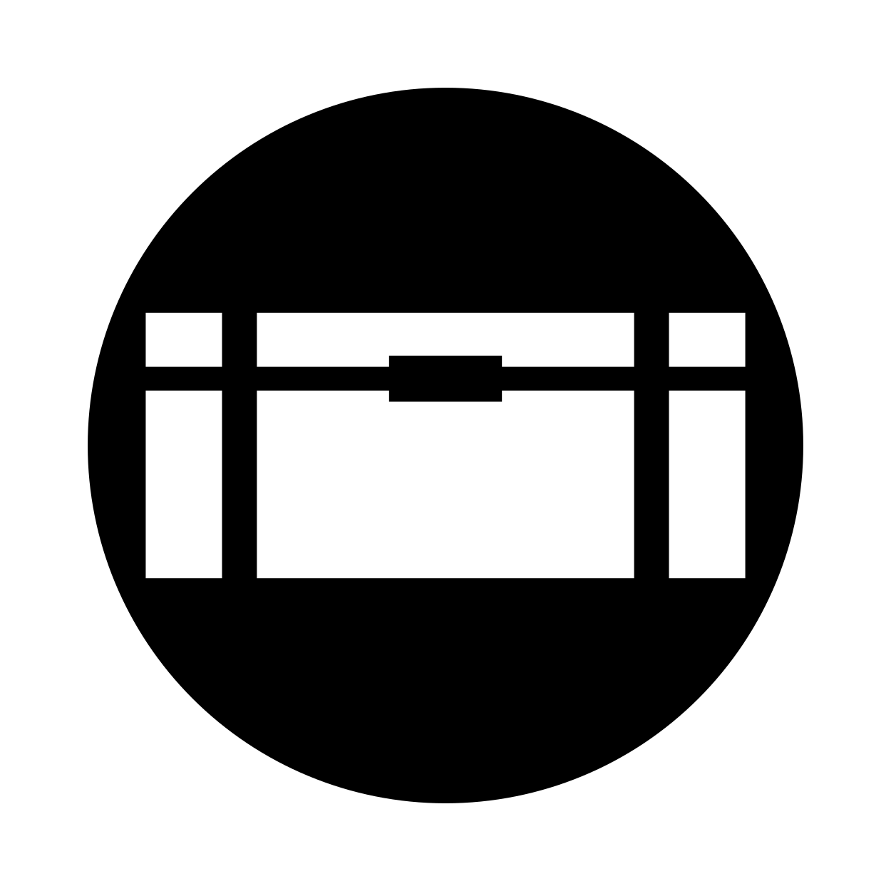

  

<h3 align="center">Pandora</h3>

  
  

---

 A box that contains tools, nugets, scripts, templates and snippets.
      

## About

Aims to develop software more easily through tools, nugets, scripts, templates, code snippets, etc.

## Authors

* Alexandre Beauchamp &#8212; main developer

## Acknowledgements

* Readme is based on this fantastic repository *[The-Documentation-Compendium]* with his templates.
* Changelog is based on https://keepachangelog.com/en/1.0.0/

[The-Documentation-Compendium]: https://github.com/kylelobo/The-Documentation-Compendium/blob/master/en/README_TEMPLATES/Standard.md
